# TRF v2.1 — 系统全局架构图（System Architecture Map）

本文件提供 TRF 体系（Trend–Rotation–Flow）在 v2.1 版本中的全景结构。  
你可以将其作为整个系统的“路线图、导航图、知识地图”。

---

# 🧭 1. TRF 系统总览架构（Mermaid 图）

```mermaid
flowchart TD

%% === MAIN SYSTEM ===
A[TRF System v2.1] --> B1[01 Trend — 趋势模块]
A --> B2[02 Rotation — 轮动模块]
A --> B3[03 Flow — 资金流模块]
A --> B4[04 Risk — 风控模块]
A --> B5[05 Execution — 执行与心理]
A --> B6[06 Tools — 指标与扫描器]
A --> B7[07 Playbook — 日内 & 盘前剧本]
A --> B8[08 Backtest — 因子回测研究]
A --> B9[08 Meta — 系统维护层]
A --> B10[09 Architecture — 本系统结构图]

%% === TREND ===
B1 --> C11[趋势五因子模型]
B1 --> C12[多周期共振引擎]
B1 --> C13[趋势生命周期识别]

%% === ROTATION ===
B2 --> C21[板块轮动五维评分]
B2 --> C22[强度雷达图]
B2 --> C23[主升浪链路监控]

%% === FLOW ===
B3 --> C31[三维量能模型]
B3 --> C32[主力吸筹/换手节奏]
B3 --> C33[爆发点寻找器]

%% === RISK ===
B4 --> C41[最大回撤控制]
B4 --> C42[仓位两层结构：底仓+高弹]
B4 --> C43[止损/止盈系统]

%% === EXECUTION ===
B5 --> C51[T+0 节奏节点]
B5 --> C52[买点/卖点七段式]
B5 --> C53[情绪模型（V2.2 插槽）]

%% === TOOLS ===
B6 --> C61[趋势仪表盘]
B6 --> C62[轮动热力图]
B6 --> C63[爆发点扫描器]
B6 --> C64[回调低吸扫描器]

%% === PLAYBOOK ===
B7 --> C71[日内执行剧本]
B7 --> C72[盘前战术简报模板]
B7 --> C73[风口监测模板]

%% === BACKTEST ===
B8 --> C81[因子收益检验]
B8 --> C82[指标长期有效性验证]
B8 --> C83[参数鲁棒性检查]

%% === META ===
B9 --> C91[术语词典 Glossary]
B9 --> C92[升级日志 Changelog]
B9 --> C93[未来规划 Roadmap]
B9 --> C94[兼容性与扩展规则]

```

---

# 🗂 2. 文件结构与说明

| 模块 | 功能 | 描述 |
|------|------|------|
| 01 Trend | 趋势识别 | 判断行情是否进入趋势区间 |
| 02 Rotation | 板块轮动 | 找到接力下一棒的热点 |
| 03 Flow | 资金流 | 判断是否进入爆发前夜 |
| 04 Risk | 风控 | 控 drawdown，保留生存权 |
| 05 Execution | 执行 | 买卖节奏与心理稳定 |
| 06 Tools | 工具层 | 仪表盘、扫描器、指标 |
| 07 Playbook | 战术层 | 每天怎么执行 |
| 08 Backtest | 科学验证层 | 验证模型是否赚钱 |
| 08 Meta | 维护系统 | 术语、版本、未来规划 |
| 09 Architecture | 结构图 | 给全系统使用者一张地图 |

---

# 🧩 3. 为什么 Part 9 必须存在？

这是 TRF v2.1 最大的提升：

### ✔ 让整个系统成为“工程化”的  
不是一堆文档，而是一个 **可维护、可升级、可扩展的框架系统（Framework）**

### ✔ 用户（你）能快速定位  
看到趋势 → 找 Trend 目录  
看到轮动强 → 找 Rotation  
需要验证策略 → 找 Backtest  

### ✔ 未来如果你招助手 / 合伙人  
他们只要看本文件，就能理解全系统结构。

---

# 🧱 4. 未来升级（TRF v2.2 / v3.0）将基于此架构图继续扩展

- 情绪因子模块（Execution → Emotion）  
- AI 自动风口检测  
- 自动化回测  
- TRF 自动评分系统  
- 半导体专属评分模型（你的特色版）  

---

# 📌 End of File
（可直接提交到 GitHub）
